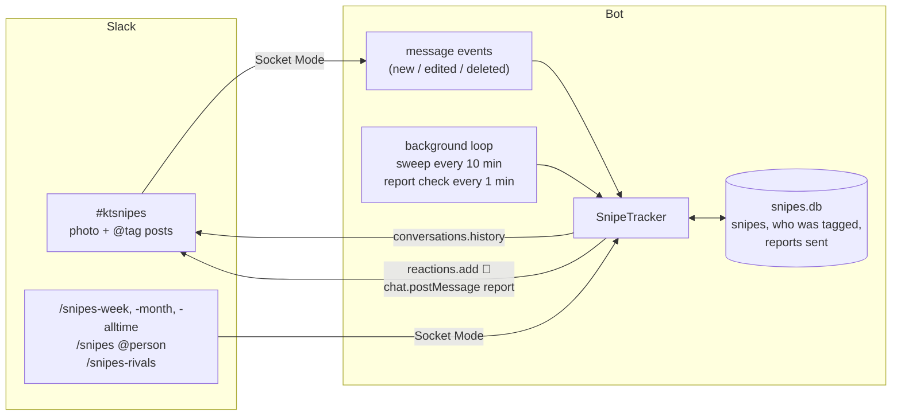

# How it works

This page is for anyone who wants to change or extend the bot.

## Overview



The bot keeps its tally in sync with the channel in two ways:

1. **Events (instant).** Slack sends a `message` event for every new post, edit (`message_changed`), and deletion (`message_deleted`) in #ktsnipes. The bot re-evaluates that one message: if it's a snipe, it's saved (and replaces any older version of it); if it isn't anymore, it's removed. New snipes get a 🎯 reaction.
2. **Sweeps (safety net).** Every `SWEEP_MINUTES`, the bot reads the last `SWEEP_DAYS` of the channel (`conversations.history`) and does the same thing for every message. Anything in the database from that window that's no longer in the channel is removed. Sweeps catch whatever happened while the bot was offline, and they're how reaction counts stay up to date.

The tally is keyed by each message's timestamp (`ts`), so saving the same message twice never double-counts it.

Once a minute, the loop also checks whether a weekly or monthly report is due. If one is due and hasn't been posted yet, the bot runs a sweep (for fresh reaction counts), builds the report from the database, posts it, and records it in the `reports` table so it's never posted twice.

On startup, if the database has no snipes at all, the bot sweeps the channel's **entire** history without reacting to anything. That's the backfill.

## What counts

`parse_snipe()` in [`bot/snipes.py`](../bot/snipes.py) decides. A message is a snipe when:
- its subtype is a normal post, a file share, or a thread broadcast (not a join message, bot message, etc.),
- it isn't a thread-only reply,
- at least one attached file has an `image/*` mimetype,
- its text contains at least one `<@U…>` mention (how Slack encodes @tags) that isn't the poster and isn't a bot.

The poster is the **sniper**; each tagged person is a **target**. A snipe's "count" is its number of targets, so one post tagging three people is three snipes for the poster and one sniped for each target.

### Changing what counts

| Want to… | Change |
|---|---|
| Count videos too | In `has_image()`, also accept `mimetype.startswith("video/")` |
| Make a group photo count as one snipe | In `snipe_counts()` and `best_day()` in `stats.py`, add `1` instead of `len(s.targets)` |
| Count thread replies | Remove the `thread_ts` check in `parse_snipe()`. Note that `conversations.history` doesn't return thread replies, so sweeps would also need `conversations.replies`. |
| Let self-tags count | Remove `u != sniper` in `parse_snipe()` |

Add a test in [`tests/test_snipes.py`](../tests/test_snipes.py) for whatever you change.

## Rivalries

Rivalries aren't stored; they're computed on the fly from the `snipes` table, like every other stat. `hits()` in `stats.py` counts each `(sniper, target)` pair. `rivalries()` folds `(A, B)` and `(B, A)` into one pair with a score, puts the leader first, drops pairs with fewer than 2 snipes total, and sorts by total, then by how close the score is. The weekly report's "Rivalry of the week" is the top entry for that week.

## Code layout

| File | What's in it |
|---|---|
| [`bot/snipes.py`](../bot/snipes.py) | What counts as a snipe: image detection, @tag parsing, reaction counting |
| [`bot/store.py`](../bot/store.py) | SQLite storage: `snipes` (one row per post), `targets` (who was tagged in each), `reports` (which weeks were posted) |
| [`bot/stats.py`](../bot/stats.py) | Pure functions: the report schedule, tallies, rankings with ties, and the text of every report (week, month, all time) and `/snipes @person` |
| [`bot/rivals.py`](../bot/rivals.py) | The three `/snipes-rivals` views: top rivalries, one person's rivals, head-to-head |
| [`bot/tracker.py`](../bot/tracker.py) | `SnipeTracker`: handles events, runs sweeps, decides when the weekly and monthly reports are due and posts them |
| [`bot/main.py`](../bot/main.py) | Command-line entry point, the background loop, and the Slack event and slash command handlers |
| [`bot/config.py`](../bot/config.py) | Loads settings from environment variables |
| [`manifest.yaml`](../manifest.yaml) | Slack app definition: permissions, events, slash commands, Socket Mode |
| [`Dockerfile`](../Dockerfile), [`railway.toml`](../railway.toml) | Container image and Railway deploy settings |

## Development

```bash
python3 -m venv .venv && source .venv/bin/activate
pip install -r requirements.txt pytest
pytest
```

The tests don't need a Slack workspace. They use a `FakeClient` that stands in for the Slack API and a fake clock, so a full week (and a daylight-saving change) runs in milliseconds. See [`tests/test_snipes.py`](../tests/test_snipes.py).

### Command-line flags

```bash
python -m bot.main              # run continuously
python -m bot.main --backfill   # count every snipe in the channel's history, then exit
python -m bot.main --preview          # print this week's report so far, then exit
python -m bot.main --preview month    # ...this month's (or `all` for all time)
```

### Ideas for extending it

- **Semester awards.** `store.snipes(start, end)` works for any time range; add a `"semester"` entry to `PERIODS` in `stats.py`.
- **Streaks.** Most consecutive days with a snipe. Everything needed is already in the `snipes` table.
- **Revenge tracking.** Flag when someone snipes back the person who last sniped them, and call out the fastest revenge of the week. `head_to_head()` in `rivals.py` already walks a pair's snipes in order.
- **Officer-only commands.** Check `command["user_id"]` against a list to add something like `/snipes-void` for disputed snipes.
